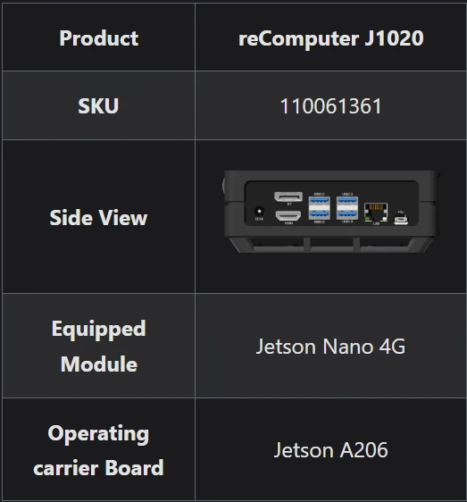
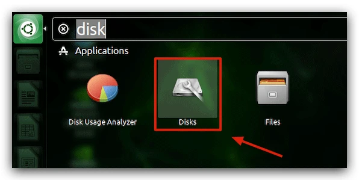
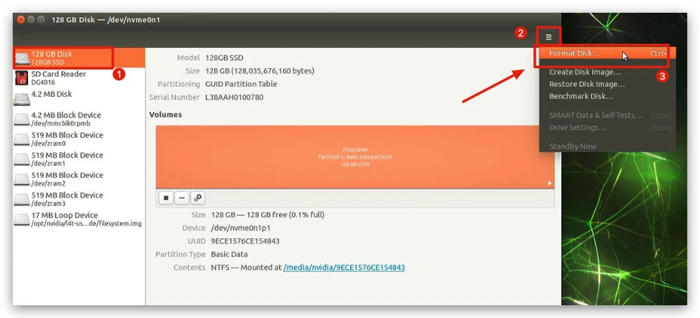
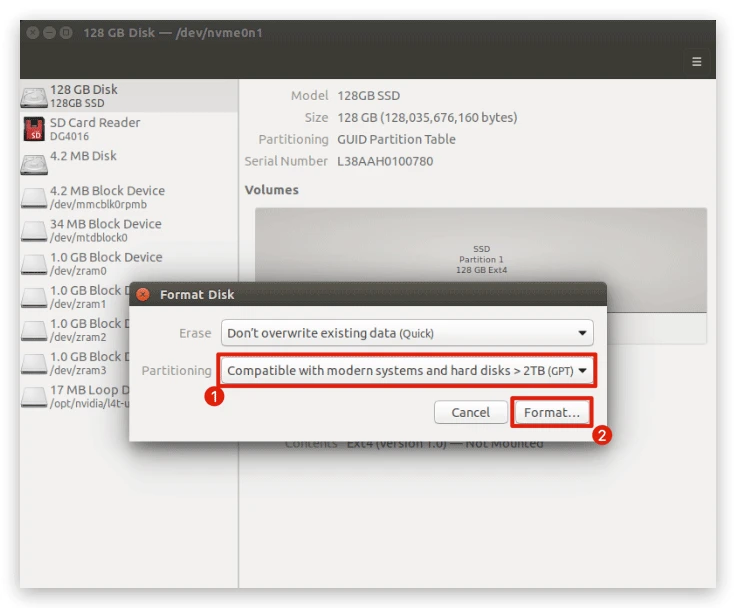
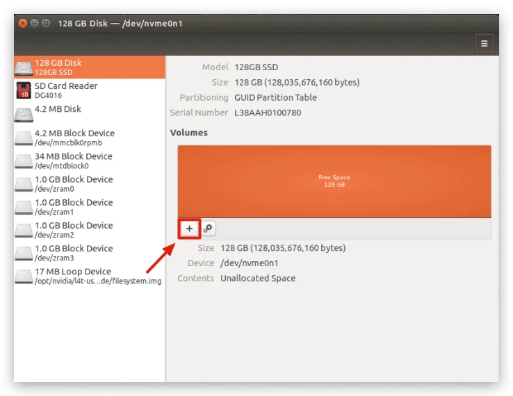
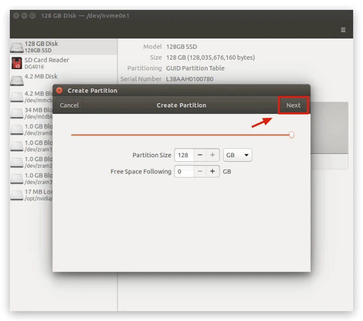
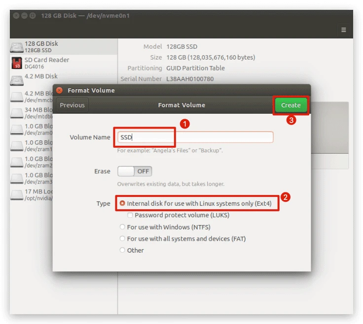
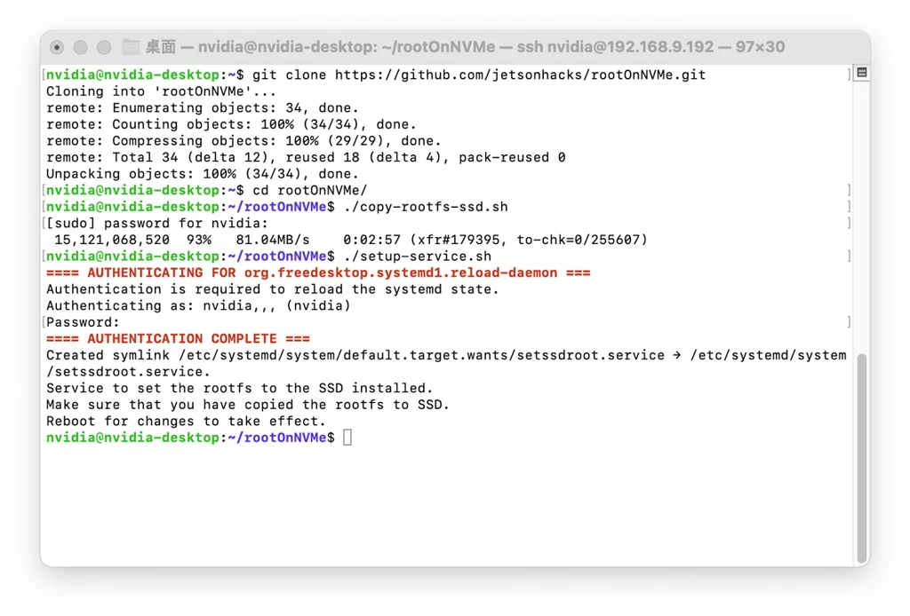
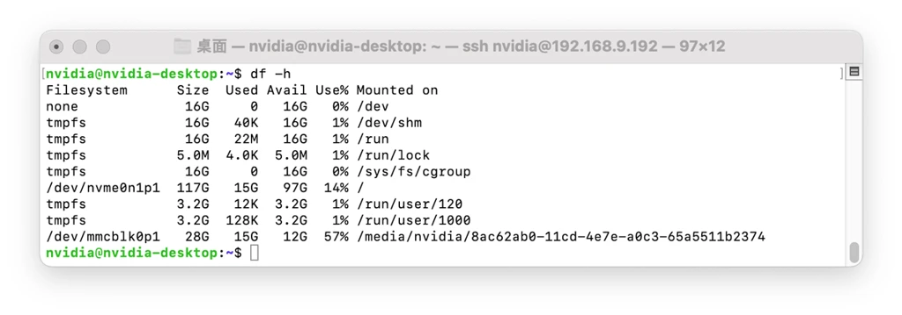

# Expansion Via M.2 Slot On Carrier Board And SSD

SSD, also known as Solid State Drives, is often used as the primary storage device for laptops, desktops, etc. With its high reliability and fast data read and write rates, it is the best choice for reComputer expansion.

::: {.text-center}
{width=40% height=60% fig-align="center"}
:::

## Software And Hardware Requirements

The following conditions need to be met for the expansion solution using SSDs, which are the basic requirements for the expansion to be proven to be successful.

- **reComputer for Jetson:** 
    - JetPack versions 4.4 ~ 4.6
    - Carrier board must contain M.2 M-Key slot
- **SSD:**
    - SSD need to be fourth generation extended file system (Ext4)
    - M.2 M-Key interface with NVMe protocol
    - Recommended capacity ≤ 512 GB

## Expansion steps
### **Step 1.** Install the SSD
Follow the steps in the [Hardware Instructions](https://wiki.seeedstudio.com/reComputer_Jetson_Series_Hardware_Layout/) to install the SSD for reComputer.

### **Step 2.** Prepare SSD
Use the shortcut **Ctrl+F** or click the Ubuntu icon in the upper left corner to search for **Disks** and open the Disks tool that comes with Ubuntu 18.04.

{fig-align="center"}

Select your SSD on the left side and then select **Format Disk** in the upper right corner under the menu bar.

{fig-align="center"}

Format your SSD to GPT format. A pop-up window will appear asking you to confirm and enter your user password.

{fig-align="center"}

Then, we click on the middle **"+"** to add a disk character.

{fig-align="center"}

Click on "Next"

{fig-align="center"}

Please give your SSD a name and select **Ext4** in the type and click "Create". At this point we have completed the SSD prep according to the expansion requirements.

{fig-align="center"}

### **Step 3.** Build the root directory to the SSD
Use the git command to download the script files we need to use to reComputer.

```{.bash code-line-numbers="true"}
git clone https://github.com/limengdu/rootOnNVMe.git
cd rootOnNVMe/
```

Then execute the following command to build the files from the root directory in the eMMC to the SSD, the wait time for this step depends on the size of the root directory you are using.

```{.bash code-line-numbers="true"}
./copy-rootfs-ssd.sh
```

### **Step 4.** Configure the environment and complete the expansion
Execute the following command to complete the configuration of rootfs.

```{.bash code-line-numbers="true"}
./setup-service.sh
```
{fig-align="center"}

When you restart reComputer, you will see that the eMMC has become an external storage device on the main interface, and you will see that the system footprint has been reduced, so the expansion was successful.

{fig-align="center"}

!!!Attention The default SSD path in the script file is `/dev/nvme0n1p1`, which is also the path assigned by default by reComputer. If you find that your SSD path does not match this with the command `sudo fdisk -l`, change the path of all `/dev/nvme0n1p1` in the files copy-rootfs-ssd.sh, data/setssdroot.service, and data/setssdroot.sh in rootOnNVMe to the path where your SSD is located.

{fig-align="center"}

The above expansion will not remove the original root directory contents from the eMMC. If you do not want to boot from the SSD, you can remove the SSD and the system will still boot from the eMMC.