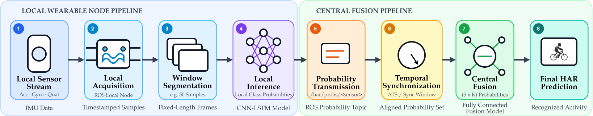

The **HAR Distributed Framework** is a multi-node wearable computing architecture developed for Human Activity Recognition (HAR) using distributed embedded processing.

Instead of continuously transmitting all raw wearable sensor measurements to a single computer for processing, the framework distributes part of the classification workload among multiple embedded edge devices.

Each edge node processes information from a wearable sensor, performs local neural network inference, and generates a probability distribution over the supported activity classes.

These local predictions are transmitted to a central computing node, where they are temporally synchronized and combined to generate the final system-level activity prediction.

## System Architecture

The framework is organized into four main computational layers:

1. **Wearable sensing**
2. **Edge inference**
3. **Communication and synchronization**
4. **Central prediction fusion**

The overall processing flow can be summarized as:

{fig-align="center"}

This architecture separates sensor-level processing from system-level decision making. Local models perform inference close to the sensing source, while the central node combines the information generated by all distributed nodes.

## Main System Components

The framework consists of three main hardware and computational groups:

### Wearable Sensor Nodes

Wearable inertial sensors are placed at multiple body locations to capture motion and orientation information during human activities.

The distributed configuration uses five sensing locations:

- Chest
- Left Hand
- Right Hand
- Left Knee
- Right Knee

Each sensing stream is associated with an embedded computing node responsible for receiving sensor measurements, preparing the model input, and performing local inference.

The wearable sensors provide inertial and orientation information that represents the movement of different regions of the body.

### Edge Computing Nodes

The edge computing nodes execute trained local Human Activity Recognition models using the data received from their corresponding wearable sensors.

The real-time system operates using fixed input windows of **50 samples**.

Once a complete window is available, the local neural network processes the sensor data and produces a probability distribution over the supported activity classes.

Conceptually, the local model output can be represented as:

```text
[p0, p1, p2, p3, p4, p5]
```

where each value represents the probability associated with one activity class.

Rather than continuously forwarding the complete raw sensor stream to the central device, the edge nodes transmit these local prediction probabilities.

### Central Computing Node

The central computing node receives predictions generated independently by all edge nodes.

Its main responsibilities include:

- receiving local probability vectors;
- temporally aligning predictions from different nodes;
- handling temporarily unavailable predictions;
- combining local probability vectors;
- executing the central fusion model;
- generating the global activity prediction;
- recording timing and synchronization information; and
- forwarding prediction results to the visualization interface.

## System Data Flow

The complete data flow of the distributed HAR framework follows the sequence below:

1. Wearable sensors acquire motion and orientation measurements.
2. Sensor measurements are transferred to their corresponding edge computing nodes.
3. Each edge node buffers the incoming data.
4. A fixed-length input window is constructed.
5. The local HAR model performs neural network inference.
6. Each local model generates an activity probability vector.
7. The probability vector is transmitted through the communication network.
8. The central node receives predictions generated by the distributed edge nodes.
9. Predictions from different nodes are temporally synchronized.
10. The synchronized probability vectors are provided to the central fusion model.
11. The fusion model generates a global activity probability distribution.
12. The final activity prediction is obtained.
13. Prediction, communication, timing, and synchronization information can be recorded for subsequent analysis.
14. The global prediction can also be forwarded to the graphical visualization interface.

## Distributed Processing Strategy

A fundamental characteristic of the framework is the separation between **local inference** and **global decision making**.

At the edge level, each embedded node processes information associated with a specific wearable sensing location.

At the central level, the system combines the predictions produced by the distributed nodes.

The computational strategy can therefore be represented as two processing stages:

```text
Sensor-Level Processing
        │
        ▼
Local Predictions
        │
        ▼
System-Level Processing
        │
        ▼
Global Prediction
```

This organization allows the framework to distribute the computational workload across multiple embedded devices while maintaining a central mechanism for system-level activity recognition.

## Probability-Level Communication

Communication between the edge nodes and the central node is performed at the **prediction level**.

The local edge devices perform inference before communicating with the central system.

The basic communication principle is:

```text
Wearable Sensor
       │
       ▼
Local Edge Device
       │
       ▼
Local HAR Model
       │
       ▼
Probability Vector
       │
       ▼
Communication Network
       │
       ▼
Central Computing Node
```

Therefore, the communication framework exchanges model outputs rather than continuously transmitting complete raw sensor windows for centralized inference.

The implementation details of the communication protocol, message structure, ROS topics, timestamps, and sequence information are described later in the documentation.

## Prediction Synchronization

Local predictions are generated by independent embedded nodes and may not arrive at the central device at exactly the same instant.

The framework therefore includes mechanisms for temporally coordinating the predictions before they are used by the central fusion model.

Under normal operating conditions, predictions generated by the different nodes are grouped according to their timestamps using approximate temporal synchronization.

The system also includes a mechanism for maintaining operation when a prediction from one or more distributed nodes is temporarily unavailable.

The detailed implementation of the synchronization mechanisms is documented separately.

## Clock Synchronization

Because timestamps are generated on independent computing devices, their system clocks must share a common time reference.

Clock synchronization is therefore required to support:

- temporal alignment of distributed predictions;
- communication latency measurements;
- synchronization measurements;
- event ordering; and
- end-to-end system performance analysis.

The framework uses network-based clock synchronization between the central and distributed computing nodes.

The complete clock synchronization configuration is documented in the corresponding implementation section.

## Central Prediction Fusion

Once local predictions have been received and synchronized, they are provided to the central fusion model.

Conceptually, the fusion process can be represented as:

```text
Chest Probabilities ────────────┐
Left Hand Probabilities ────────┤
Right Hand Probabilities ───────┤
Left Knee Probabilities ────────┤──► Fusion Model ───► Global Prediction
Right Knee Probabilities ───────┘
```

The central model combines the information generated from different body locations and produces a single probability distribution representing the global system prediction.

The architecture, training procedure, input organization, and deployment of the fusion model are described in the model development section of this documentation.

## Real-Time System Outputs

The final global prediction can be consumed by multiple components of the framework.

### Experiment Logging

The system records information required to analyze its behavior during real-time execution.

This includes information associated with:

- local predictions;
- global predictions;
- inference timing;
- communication timing;
- synchronization;
- sequence information; and
- experiment execution.

These records are later used for quantitative evaluation of the distributed framework.

### Visualization Interface

The global activity prediction is also made available to a graphical visualization interface.

The interface allows the predicted activities and system outputs to be observed while the distributed framework is operating.

The implementation and configuration of the visualization system are documented in a dedicated section.

## Complete Framework Workflow

The complete framework can be summarized as:

```text
                         HUMAN ACTIVITY
                               │
                               ▼
                     Wearable Sensor Data
                               │
                               ▼
                    Distributed Edge Nodes
                               │
                        Local Processing
                               │
                               ▼
                       Local HAR Models
                               │
                               ▼
                    Probability Predictions
                               │
                               ▼
                   Communication Framework
                               │
                               ▼
                    Temporal Synchronization
                               │
                               ▼
                     Central Fusion Model
                               │
                               ▼
                    Global HAR Prediction
                         │             │
                         ▼             ▼
                      Logging    Visualization
```

## Documentation Scope

The objective of this documentation is not only to describe the architecture of the HAR Distributed Framework, but also to document **how each component was implemented**.

The documentation progressively covers:

- hardware infrastructure;
- wearable sensor configuration;
- embedded computing devices;
- network infrastructure;
- software environments;
- data acquisition;
- sensor data preprocessing;
- dataset preparation;
- neural network development;
- local model training;
- central fusion model training;
- centralized baseline development;
- distributed deployment;
- communication configuration;
- synchronization mechanisms;
- real-time execution;
- experiment logging;
- graphical visualization;
- performance evaluation;
- robustness experiments;
- result reproduction; and
- troubleshooting.

Each technical section is intended to explain both the role of the corresponding component and the practical steps required to reproduce its implementation.

## Documentation Organization

The implementation documentation is organized according to the practical development flow of the framework:

```text
Framework Overview
       │
       ▼
Hardware Setup
       │
       ▼
Software Environment
       │
       ▼
Data Acquisition
       │
       ▼
Data Preparation
       │
       ▼
Model Development
       │
       ▼
Distributed Deployment
       │
       ▼
Communication Framework
       │
       ▼
Synchronization
       │
       ▼
Real-Time System
       │
       ▼
Experiments
       │
       ▼
Result Reproduction
       │
       ▼
Troubleshooting
```

This organization allows the documentation to be followed sequentially by a reader interested in understanding or reproducing the complete framework.

## Next Step

The next section describes the **hardware infrastructure** used to implement the distributed HAR framework, including the wearable sensing devices, embedded edge computing nodes, central computing platform, and communication network.